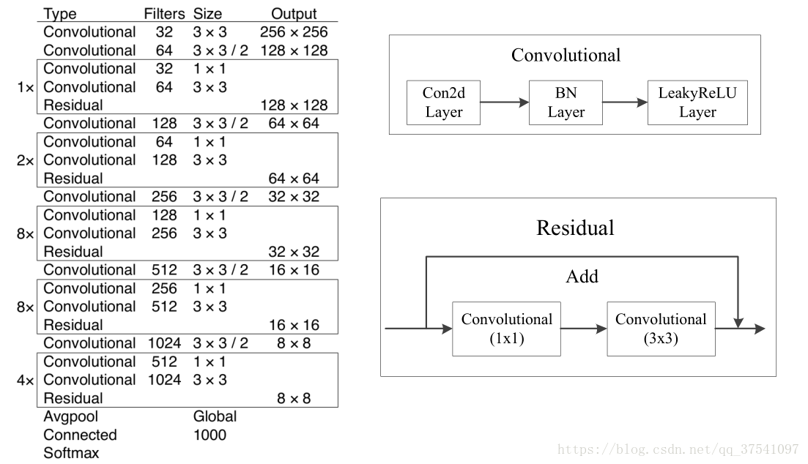

### Yolov3 从零开始--不解析config文件

##### 论文：<https://pjreddie.com/media/files/papers/YOLOv3.pdf>

##### 路径

- [x] 构建darknet53
- [ ] 由真实的图片和标签生成训练目标
- [ ] ......
- [ ] 终极目标使用pytorch1.0构建yolov3 所有部分

1. #### Darknet

   根据论文中的结构图搭建darknet。代码实现在networks/darknet.py中。

   #### 

2. #### 由真实的图片和标签生成训练目标
    ##### 2.1 数据集的选取
    ​	选取mxnet的《动手深度学习中的》最简单的'皮卡丘数据集'作为学习的数据集. 优点是数据集很小, 只有皮卡丘一个类别, 易于算法的快速实现. 后期理解了算法再去coco或者自己的数据集上训练 .[mxnet教程](<https://zh.d2l.ai/chapter_computer-vision/object-detection-dataset.html>)  
    	根据教程里面的脚本做了些修改, 将皮卡丘数据集转成了图片(.jpg)加上标签(.txt)的格式。由于皮卡丘数据集中每一张图片中只有一个目标， 在txt文件中每一行代表一个样本的标签，第一位是目标类别都是0， 剩下的依次是xmin, ymin, xmax, ymax。都是归一化后的数值。

    ##### 2.2 生成训练目标

    ​	这一步的目的是生成Yolo，所想要生成的训练的target。

    ​	1. 首先查看yolo网络最后生成的特征图的构成, 现在先考虑yolov1的情况, 没有多尺度, 图像分成13*13个格子。其中需要预测每一个格子中有两个anchor，每一个anchor需要预测(x, y, w, h, confidence).

    ​	

last update：2019年07月16日15:46:15
很详细的一篇blog: https://blog.csdn.net/leviopku/article/details/82660381

基于kera的一个实现：<https://github.com/qqwweee/keras-yolo3>